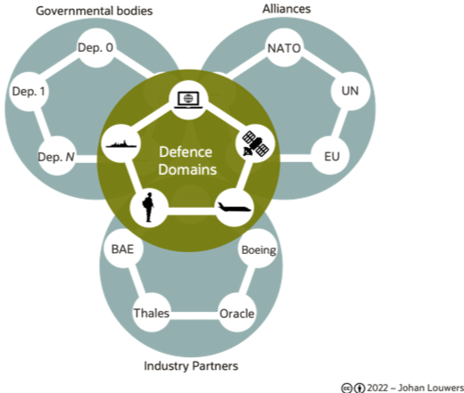
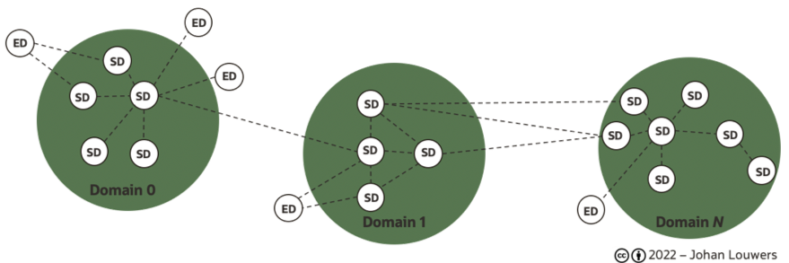

# CDEF introduction 
The Open Common Defence Event Format (CDEF) provides a standard to both the defence industry and the IT industry as well as individual armed forces and NATO to incorporate event-driven Integration and Interoperability for Multi-Domain defence collaboration. CDEF enables Multi-Domain Integration and Interoperability between individual weapon system components, weapon systems, military units and army groups as well as military alliance parties and governmental and non governmental organisations. By enabling secured event-driven data sharing between all mission relevant military and non military assets realtime information driven warfare and situational awareness. 

Event-driven architecture uses events to trigger and communicate between decoupled and distributed services and is common in modern application and system design. CDEF provides the required standard event format definitions and binds the Event-driven architecture concept with the data mesh concept. Within this the jont concept all assets are a node in the wider data mesh and are able to both produce as well as consume events and share data an consume data when and where needed and allowed by security, classification and operational security definitions. 

## Common Defence Event Format - CDEF - related standards
The Open Common Defence Event Format (CDEF) incorporates a number of standing military and industry best practices and standards into one single standard for both the defence industry and the IT industry as well as individual armed forces and NATO for the security, creation, consumption and transportation of events in a distributed system setup enabling both event-driven Integration and Interoperability for Multi-Domain defence collaboration as well as secured Multi-Domain data mesh based integration. 

### CNCF CloudEvents
CloudEvents is a Cloud Native Computing Foundation CNCF specification for describing event data in common formats to provide interoperability across services, platforms and systems. Event Formats specify how to serialise a CloudEvent with certain encoding formats. Compliant CloudEvents implementations that support those encodings MUST adhere to the encoding rules specified in the respective event format. All implementations MUST support the JSON format.

### US Department of Defence (DoD) json-ism standard
The json-ism standard focusses on JSON payload classification where the open CDEF standard has a focus on JSON based events to be used in NATO event based architectures and data mesh constructs. Department of Defence (DoD) policy requires the identification and protection of national security information and controlled unclassified information (CUI). Department of Defence Manual (DoDM) 5200.01, Volumes 2 and 4 (referenced below) describe how to appropriately mark classified information and CUI to facilitate information sharing. These markings are used (along with other factors) to make access/dissemination decisions.

The json-ism standard is focusing on the use of JSON payloads and tries to provide an alternative for the older XML based standards. Extensible Markup Language (XML) is widely used within the DoD to share information and a comprehensive marking standard called Information Security Marking Metadata (ISM or IC-ISM) has been made available by the Office of the Director of National Intelligence (referenced below). We are not aware of any similar marking standards based on JavaScript Object Notation (JSON). With the ever increasing popularity of event based architectures and data mesh architectures for sharing information between applications/systems, many now using JSON over XML, a standard for marking JSON based events has become necessary. The open CDEF standard aims at including the principles of the JSON-ISM and ISM/ISM-C Information Security Marking Standard within the event JSON payload standard to be used within the wider NATO architecture.

### External Reference documentation
* [US DoDM 5200.01, Volume 2 - DoD Information Security Program: Marking of Classified Information](http://www.dtic.mil/whs/directives/corres/pdf/520001_vol2.pdf)
* [US DoDM 5200.01, Volume 4 - DoD Information Security Program: Controlled Unclassified Information (CUI)](http://www.dtic.mil/whs/directives/corres/pdf/520001_vol4.pdf)
* [US Office of the Director of National Intelligence - Information Security Marking Metadata (ISM)](https://www.dni.gov/index.php/about/organization/chief-information-officer/information-security-marking-metadata)
* [US Office of the DoD CIO - JSON Information Security Marking Standard (JSON-ISM)](https://github.com/DoDCIO/json-ism/)
* [CNCF cloudevents](https://cloudevents.io/)

## Common Defence Event Format - CDEF - Domain Driven Design
As part of the wider concepts such as defence Multi-Domain Integration, JADC2 and others defence organisations strive to ensure Integration and Interoperability between all defence and non defence domains to form one integration en interoperating platform to support defence operations in the widest sense of the word. 

Centrally in this strategy is the use of Domain Driven Design and the concept of a domain, is: a domain is a “A sphere of knowledge or activity” and can be translated into a grouping of "components" that jointly form a logical group/domain. A domain is always aimed at fulfilling one logical task and can consist out of multiple technical components, which individually can also be (sub-)domains if the parent domain. Domain-Driven Design is an approach to software development that centers the development on programming a domain model that has a rich understanding of the processes and rules of a domain. 

Within the wider concept the defence space is itself can be considered the "defence domain" which itself holds multiple (sub-)domains which are referred to as; **land**, **sea**, **air**, **space** and **cyber**. In addition to the defined defence domains with their respected (sub-)domains other non defence domains are recognized within the wider concept; 

* **Governmental bodies**; holding (sub-domains) classified as non defence departments. 
* **Alliances**; holding (sub-)domains like the European Union, the NATO, the United Nations and others.
* **Industry Partners**; holding (sub-domains) of services provided by defence and non defence enterprises, however, excluding the deployed assets purchased from those companies and fully operated by a defence organisation. 

The combined set of the defence domain (including the land, sea, air, space and cyber sub-domains), the Governmental domain (including the various governmental sub-domains), the alliances domain (including the various alliances sub-domains) and the industry partner domain (including the various industry partner service sub-domains) jointly form the full extend of a Multi-Domain defence collaboration.  

Within the given model, each domain can hold multiple sub-domains which in turn can hold sub-domains. Following this logical model this provides a theoretical infinite drill-down possibility from a high conceptual level down to the smallest field deployed sensor carried by a soldier.

### Domain / Node Integration and Interoperability
Multi-(defence)-Domain Integration and Interoperability aims at integrating multiple defence and non defence systems in a way that they form a single large distributed system capable of supporting the needs of modern defence organisations and alliances. Enabling Integration and Interoperability between systems from different defence domains, different countries, different vendors and different technologies as well as the integration of defence and none defence parties and the interoperability between their systems.
